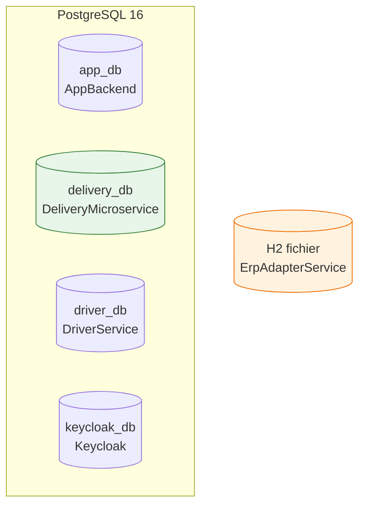
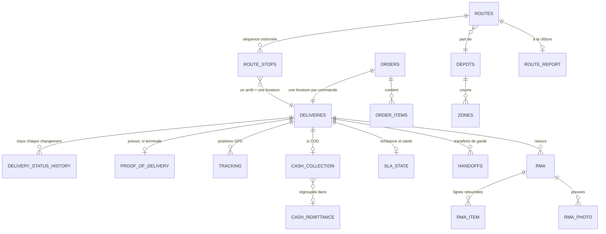
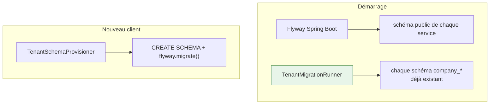

# Base de données

## Une base par service



**Aucun service ne lit la base d'un autre.** Vérifiable : aucune configuration ne pointe vers la base
d'un voisin. Les données traversent par message ou par appel `/internal/`.

!!! question "Pourquoi H2 pour l'adaptateur ERP"
    Il ne stocke que des correspondances de champs, des caches de capacités et des curseurs de
    synchronisation — quelques milliers de lignes, jamais interrogées de façon complexe. Un
    PostgreSQL dédié serait un conteneur de plus à exploiter et sauvegarder pour un magasin de
    configuration. **La contrepartie est réelle** : H2 en mode fichier n'accepte qu'un seul écrivain,
    donc ce service ne peut pas être répliqué en l'état.

---

## Le schéma métier principal



**Pourquoi ce diagramme.** Il montre que **`deliveries` est le pivot** : sept tables y font
référence. Toute évolution de cette table touche l'ensemble du domaine.

**Observations importantes.**

- **`orders` ↔ `deliveries` est un un-à-un.** Une commande importée produit exactement une livraison.
  Une livraison partielle ne crée pas de seconde livraison ici : le reliquat est **un nouveau
  transfert côté ERP**, réimporté ensuite comme une nouvelle commande.
- **`delivery_status_history` n'est pas un journal technique** : c'est ce que le back-office affiche
  dans la chronologie et ce qu'un litige utilise.
- **`route_stops` porte l'ordre**, pas `deliveries`. Une même livraison peut apparaître dans une
  tournée annulée puis dans une autre.

---

## Les tables techniques

| Table | Rôle | Pourquoi elle existe |
|---|---|---|
| `outbox_event` | événements en attente d'émission | garantit qu'un fait métier et son événement sont écrits ensemble |
| `processed_requests` | clés d'idempotence | un rejeu mobile ne crée pas de doublon |
| `erp_sync_event` | trace des échanges ERP | diagnostiquer une synchronisation sans lire les logs |
| `audit_logs` | qui a fait quoi | exigence de traçabilité |
| `notifications` | notifications persistantes | survivre au rechargement de page |
| `sla_state` | échéance et santé par livraison | éviter de recalculer un SLA à chaque affichage |

---

## Qualité du schéma

| | |
|---|---|
| Tables (base des livraisons) | 34 |
| Migrations Flyway | 44 |
| Index | 64 |
| Clés étrangères | 32 |
| Contraintes `CHECK` | 28 |
| Colonnes `NOT NULL` | 203 |

!!! success "Les horodatages portent le nom de l'événement"
    `collected_at`, `changed_at`, `inspected_at`, `picked_up_at` plutôt qu'un `created_at`
    générique. C'est plus précis : la colonne dit **quel fait métier** elle date.

---

## Le versionnement du schéma



**Les quatre services partagent la même stratégie :** Flyway, un script de référence par service,
adoption des schémas existants par *baseline*, et `ddl-auto` désactivé (`none`, ou `validate` pour
l'adaptateur ERP).

!!! warning "Le piège qu'il a fallu corriger"
    `AppBackend` exécutait un `schema.sql` **sans suivi de version** : modifier le fichier ne touchait
    que les nouveaux clients. Le passage à Flyway seul n'aurait rien réglé — il fallait aussi le
    `TenantMigrationRunner`, sans quoi les clients déjà en base n'auraient toujours rien reçu.

    L'adaptateur ERP laissait Hibernate écrire ses tables (`ddl-auto: update`), qui n'enlève ni ne
    renomme jamais rien et ne laisse aucun historique. Il est passé à `validate` : Hibernate ne touche
    plus au schéma mais **refuse de démarrer** si celui-ci diverge des entités.

### Vérifié dans les deux sens

Le risque d'une telle bascule est précis : une référence qui adopte correctement l'existant **tout en
produisant un schéma faux sur une base neuve**. Les deux cas ont donc été testés séparément.

| | Bases existantes | Base neuve |
|---|---|---|
| AppBackend | 6 schémas adoptés, signature de colonnes inchangée | V1 sur un schéma vide → **signature identique** |
| ErpAdapter | base adoptée, `validate` passe | Flyway applique V1, `validate` passe, service démarré |

---

## Sauvegarde

`postgres-delivery` — et lui seul — archive ses journaux WAL en continu :

```yaml
-c archive_mode=on
-c archive_command='test ! -f /wal-archive/%f && cp %p /wal-archive/%f'
-c archive_timeout=300
```

**Pourquoi seulement celle-là.** Un dump nocturne seul signifie qu'un incident à 15 h coûte tout ce
qui s'est passé depuis 2 h 30. Avec les journaux, la perte est bornée par `archive_timeout` — cinq
minutes. Les bases Keycloak et livreurs bougent peu et se contentent du dump quotidien.

!!! danger "Point d'attention"
    Les scripts de sauvegarde existent dans `ops/backup/`, mais **`install-cron.sh` n'a jamais été
    exécuté**. Tant que ce n'est pas fait, il y a des scripts qui savent sauvegarder — pas de
    sauvegarde.
