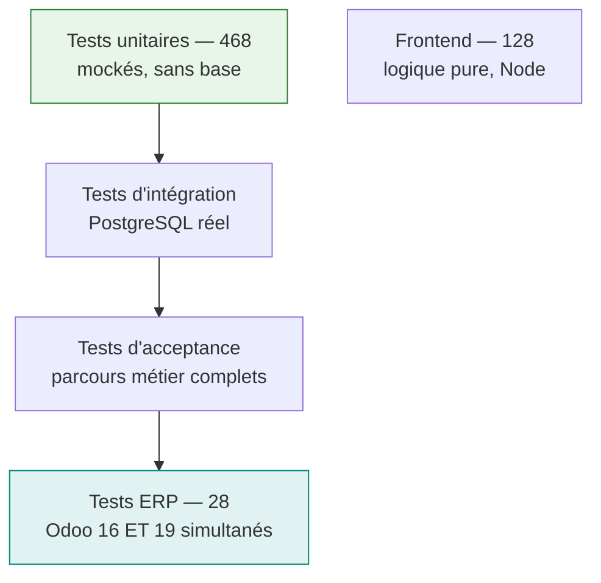
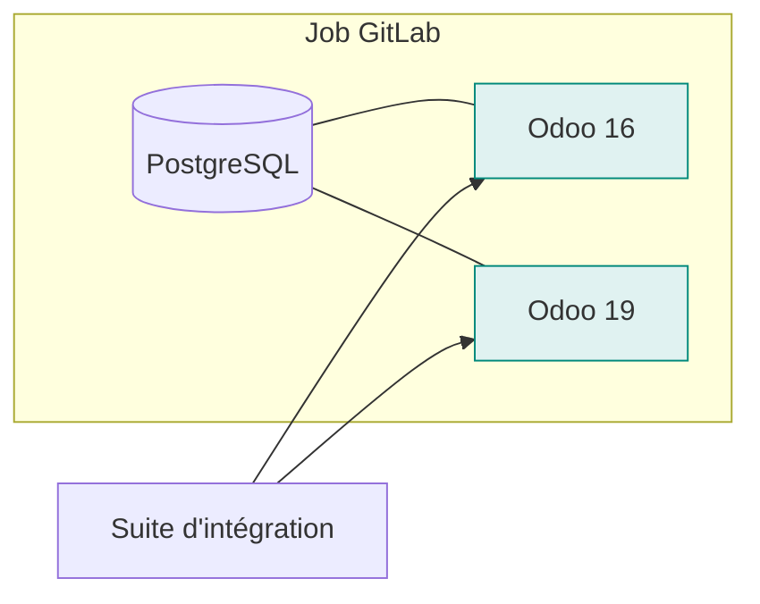
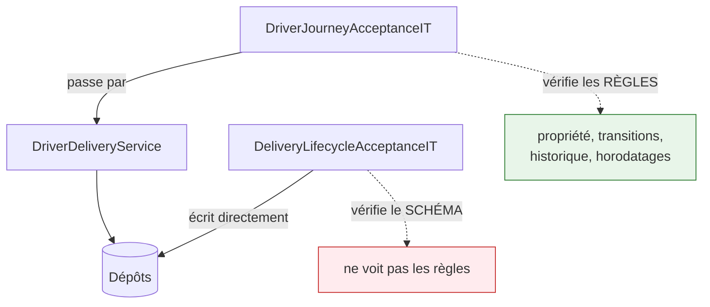

# Tests

## La pyramide, telle qu'elle est



| Niveau | Nombre | Ce qu'il protège |
|---|---|---|
| Unitaires backend | **468** | règles métier, calculs, résolution de capacités |
| Intégration + acceptance | **21** | schéma, transactions, isolation des clients |
| ERP deux versions | **28** | le contrat Odoo réel, 16 et 19 |
| Frontend | **128** | logique pure, parité des traductions |

---

## Ce que les tests ERP apportent vraiment



**Les deux extrémités de la plage supportée sont couvertes**, donc les versions intermédiaires le
sont par construction : le connecteur ne teste pas des numéros de version mais la **présence** des
champs et méthodes.

Ces tests épinglent précisément ce qui change :

- `stock.move.line.qty_done` → `quantity`
- `create_returns` → `action_create_returns`
- le pilotage des assistants de confirmation

!!! warning "Le job ne tourne pas à chaque commit"
    Installer `sale` et `stock` sur deux instances neuves coûte plusieurs minutes. Le job est donc
    lié aux modifications de `Microservices/ErpAdapterService/` — il se déclenche **exactement quand
    il peut attraper quelque chose**. Un commit qui ne touche que le frontend ne le montre pas, et
    ce n'est pas une panne.

    Pour le forcer : **Run pipeline** depuis l'interface GitLab (règle
    `CI_PIPELINE_SOURCE == "web"`).

---

## Les tests de caractérisation du parcours livreur

Neuf tests traversent le **vrai service**, pas les dépôts.



**Pourquoi ils ont été écrits.** Le découpage de `DriverDeliveryService` (1 192 lignes) ne pouvait
être montré sûr sur rien : aucun test ne traversait cette classe.

**Ils ont immédiatement servi.** Après le découpage, le contexte Spring ne démarrait plus :
`ExceptionResolutionService` et `RmaService` étaient injectés en `@Lazy` dans l'original — avec le
commentaire *« Lazy to avoid any construction-time cycle »* — et les passer en arguments de
constructeur recréait le cycle. **Tout compilait parfaitement.** Sans ces tests, la panne se serait
manifestée au démarrage d'un conteneur, ou pendant une démonstration.

!!! tip "Ce qui rend un test de caractérisation utile"
    Il affirme des **résultats observables** — un statut atteint, un horodatage posé, un appelant
    refusé — jamais une structure interne. C'est ce qui lui permet de survivre au découpage de la
    classe qu'il protège.

---

## Lancer les tests

=== "Unitaires"

    ```bash
    cd Microservices/<Service>
    gradle test
    ```

=== "Intégration (PostgreSQL)"

    ```bash
    cd Microservices/DeliveryMicroservice
    gradle integrationTest
    # Testcontainers en local, ou IT_DB_URL vers un PostgreSQL existant
    ```

=== "ERP deux versions"

    ```bash
    # nécessite deux instances Odoo joignables
    ODOO_V16_URL=http://localhost:8069/jsonrpc ODOO_V16_DB=odoo16 \
    ODOO_V19_URL=http://localhost:8070/jsonrpc ODOO_V19_DB=odoo19 \
    gradle integrationTest
    ```

=== "Frontend"

    ```bash
    cd Apps/admin-app-react
    npm test
    ```

!!! danger "Bases jetables uniquement"
    La suite ERP crée des partenaires, des produits, des commandes et valide des transferts. Elle ne
    se pointe pas sur une instance dont les données comptent.

---

## Ce qui n'est pas couvert

Honnêteté sur les angles morts :

| Zone | Couverture | Risque |
|---|---|---|
| `DriverService` | 19 tests / 78 classes | faible — service simple |
| `AppBackend` | 31 tests / 53 classes | moyen — pilote Keycloak |
| Application Flutter | aucun test automatisé | testée manuellement |
| Parcours de bout en bout | script `ops/cod/e2e.sh` (19 étapes) | manuel, pas en CI |
